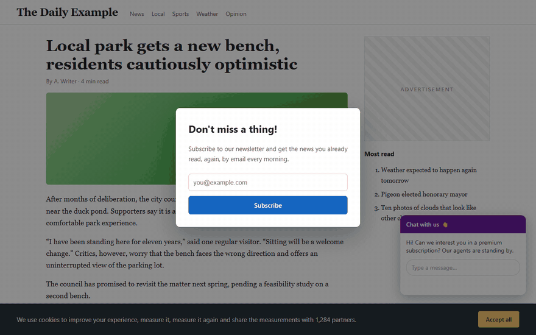
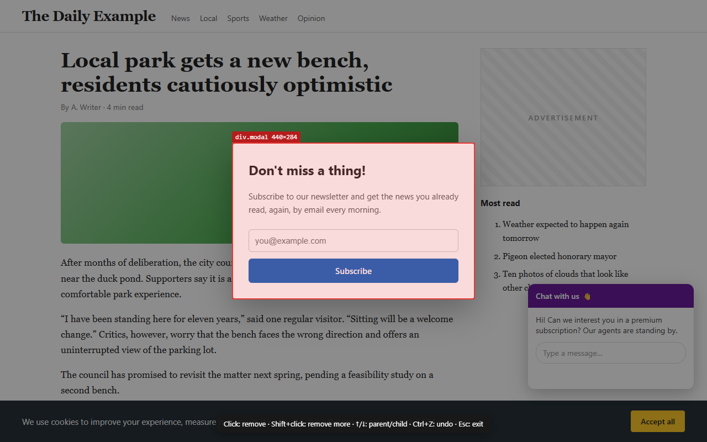
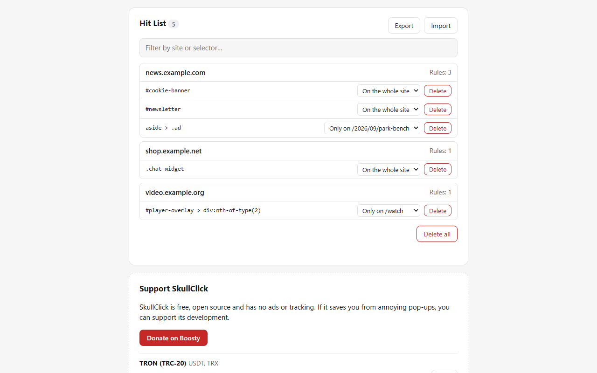

<p align="center">
  
</p>

<h1 align="center">SkullClick</h1>

<p align="center">
  <b>Click to remove ads, pop-ups, cookie banners and any other annoying element from a web page.</b><br>
  Like <a href="https://en.wikipedia.org/wiki/Xkill">xkill</a>, but for web pages. For Firefox, Edge and Chrome.
</p>

<p align="center">
  <a href="#install">Install</a> ·
  <a href="#how-to-use">How to use</a> ·
  <a href="#whats-new-compared-to-ekill">What's new</a> ·
  <a href="#support-the-project">Support</a> ·
  <a href="#русский">Русский</a>
</p>

<p align="center">
  
</p>

## Features

- **One click, element gone.** Press <kbd>Alt</kbd>+<kbd>Shift</kbd>+<kbd>K</kbd> or the toolbar
  icon, point at anything and click. Works on pop-ups, overlays, sticky headers, chat widgets
  and embedded iframes.
- **Undo.** Changed your mind? <kbd>Ctrl</kbd>+<kbd>Z</kbd> or the *Undo* button brings it back.
- **Pick the right thing.** <kbd>↑</kbd> selects the parent element, <kbd>↓</kbd> goes back to
  the child: easy to grab the whole dimmed backdrop, not just the dialog in it.
- **Remove several at once.** <kbd>Shift</kbd>+click keeps the picker on.
- **Grudge mode (optional).** SkullClick remembers what you removed and hides it automatically
  on your next visits, on one page or on the whole site.
- **Your hit list, your file.** Review, edit, export and import remembered elements.
- **Private by design.** No data collection, no analytics, no network requests. Doesn't even ask
  for access to websites unless you turn Grudge mode on.
- Works on sites that fight back (swallowed clicks, strict Content Security Policy).
- English and Russian interface, light and dark theme.

## Install

| Browser | How |
|---|---|
| **Firefox** | [Firefox Add-ons (AMO)](https://addons.mozilla.org/firefox/addon/skullclick/) |
| **Microsoft Edge** | Manual install from [GitHub Releases](https://github.com/Perruer/skullclick/releases), the same steps as for Chrome at `edge://extensions` |
| **Chrome, Brave, Vivaldi, Opera** and other Chromium browsers | Manual install from [GitHub Releases](https://github.com/Perruer/skullclick/releases), see below |

### Chrome: manual install from GitHub Releases

SkullClick is not in the Chrome Web Store, but Chrome can load it directly:

1. Open the [latest release](https://github.com/Perruer/skullclick/releases/latest) and download
   **`skullclick-chrome-<version>.zip`**.
2. Unzip it into a folder you will keep, for example `Documents\SkullClick`.
   Don't delete the folder afterwards: Chrome loads the extension from it.
3. Open **`chrome://extensions`** in the address bar.
4. Turn on **Developer mode** (toggle in the top-right corner).
5. Click **Load unpacked** and select the unzipped folder, the one that contains `manifest.json`.
6. Click the puzzle icon 🧩 on the toolbar and pin **SkullClick** 📌.

To update, download the new zip, replace the files in the same folder and press the ↻ reload
button on the SkullClick card in `chrome://extensions`. Your settings and hit list are kept.

> Chrome may show a banner about extensions in developer mode on startup. It's safe to dismiss:
> it appears for every extension that isn't installed from the Chrome Web Store.

The same steps work in Brave (`brave://extensions`), Vivaldi, Opera and Edge (`edge://extensions`).

## How to use



| Key | Action |
|---|---|
| <kbd>Alt</kbd>+<kbd>Shift</kbd>+<kbd>K</kbd> or the toolbar icon | Start / stop picking |
| Click | Remove the highlighted element |
| <kbd>Shift</kbd>+click | Remove and keep picking |
| <kbd>↑</kbd> / <kbd>↓</kbd> | Select the parent / back to the child element |
| <kbd>Enter</kbd> | Remove the selected element |
| <kbd>Ctrl</kbd>+<kbd>Z</kbd> | Undo the last removal |
| <kbd>Esc</kbd> | Stop picking |

The shortcut can be changed at `chrome://extensions/shortcuts` (Chrome), `edge://extensions/shortcuts`
(Edge) or *about:addons → ⚙ → Manage Extension Shortcuts* (Firefox). An optional shortcut for
"undo the last removal" is available there too.

Removed elements come back when you reload the page, unless Grudge mode is on.

### Grudge mode

Turn it on in the SkullClick options. From then on every element you remove is remembered and
hidden automatically the next time you open the same page. In the hit list you can decide per
element whether it should be hidden on that page only or on the whole site, delete entries, and
export or import the list as JSON.



Grudge mode needs the "Access your data for all websites" permission so it can run as pages
load. SkullClick asks for it only when you turn the mode on. The hit list is stored locally in
your browser and is never sent anywhere; see the [privacy policy](PRIVACY.md).

## What's new compared to ekill

SkullClick 2.0 is a rewrite of [ekill](https://github.com/rhardih/ekill), which stopped working
in Chrome when Manifest V2 was retired and hasn't been updated since 2019.

- Ported to **Manifest V3**; one code base, builds for Chromium and Firefox.
- **Fewer permissions:** no access to websites by default (ekill always injected a script into every page).
- **Undo**, **parent/child selection**, **Shift+click** to remove several elements.
- Elements are hidden instead of deleted, so remembered selectors stay stable
  ([ekill#22](https://github.com/rhardih/ekill/issues/22)).
- Fixed invalid selectors for classes like `u-hidden@desktop-max` or `ver-5.7`
  ([ekill#30](https://github.com/rhardih/ekill/issues/30), [ekill#34](https://github.com/rhardih/ekill/issues/34)).
- Works on pages that swallow mouse events, e.g. Notion
  ([ekill#35](https://github.com/rhardih/ekill/issues/35)).
- The toolbar counter updates immediately ([ekill#33](https://github.com/rhardih/ekill/issues/33)).
- Available for Edge ([ekill#36](https://github.com/rhardih/ekill/issues/36)).
- Removed iframes are unloaded and removed videos are paused, so hidden players stop playing.
- New options page without jQuery/Bootstrap: search, per-rule scope, export/import, dark theme.
- Fixed a bug where deleting an entry from the hit list removed a different one.
- English and Russian translations.
- Default shortcut changed from <kbd>Ctrl</kbd>+<kbd>Shift</kbd>+<kbd>K</kbd> (it opens the Web Console in Firefox) to <kbd>Alt</kbd>+<kbd>Shift</kbd>+<kbd>K</kbd>.

Full list in the [changelog](CHANGELOG.md).

## Build from source

Requires Node.js 20+.

```bash
npm install
npm run build      # dist/chrome and dist/firefox (unpacked)
npm run package    # dist/skullclick-chrome-<version>.zip and dist/skullclick-firefox-<version>.zip
npm test           # unit tests
npm run test:e2e   # end-to-end tests in Chrome for Testing and Firefox
npm run lint       # web-ext lint for the Firefox build
```

The source is not minified or bundled: `scripts/build.mjs` copies `src/` and generates the
browser-specific `manifest.json`. To try a development build in Firefox, run `npm run start:firefox`
or load `dist/firefox/manifest.json` via `about:debugging` → *This Firefox* → *Load Temporary Add-on*.

Bug reports and pull requests are welcome in [Issues](https://github.com/Perruer/skullclick/issues).

## Support the project

SkullClick is free, open source, and has no ads or tracking. If it saves you
from annoying pop-ups, you can support its development:

- **Boosty:** https://boosty.to/mikio_kuroki/donate
- **USDT / TRX, TRON (TRC-20):** `TXUBW4e88SDTfrnJRKfbhYfFcggufbonc1`
- **USDT / USDC / ETH, Ethereum or any EVM network (ERC-20):** `0x1378491169064702786b2E5b58c6375776177E8A`
- **TON / USDT on TON:** `UQAhI7EKzoa-JuKOfv0ULMzA3FrmpxsDkXj8Qevwj2z1cMRN`

Send only on the network listed next to each address. Starring the repository,
leaving a review on the add-on page and reporting bugs help a lot too.

## Based on ekill by René Hansen

SkullClick is a fork of [ekill](https://github.com/rhardih/ekill) by
[René Hansen](https://github.com/rhardih), released under the MIT License.
Thanks to René for the original idea and code. The original copyright notice is
kept in [LICENSE](LICENSE).

## License

[MIT](LICENSE) © 2018 René Hansen, © 2026 Perruer

---

## Русский

**SkullClick** убирает рекламу, всплывающие окна, баннеры cookie и любые мешающие элементы
страницы одним кликом. Работает в Firefox, Edge и Chrome.

### Возможности

- Нажмите <kbd>Alt</kbd>+<kbd>Shift</kbd>+<kbd>K</kbd> или значок на панели, наведите на
  элемент и кликните, и он исчезнет. Работает и с iframe (чаты, встроенные плееры).
- **Отмена:** <kbd>Ctrl</kbd>+<kbd>Z</kbd> или кнопка «Отменить».
- <kbd>↑</kbd> / <kbd>↓</kbd> выбирают родительский или дочерний элемент, <kbd>Shift</kbd>+клик
  позволяет удалить несколько элементов подряд.
- **Злопамятность** (по желанию): SkullClick запоминает удалённое и скрывает его при следующих
  посещениях страницы или всего сайта. Список можно редактировать, экспортировать и импортировать.
- Ничего не собирает и никуда не отправляет. Доступ к сайтам запрашивает, только если включить злопамятность.
- Интерфейс на русском и английском.

### Установка

- **Firefox:** [Firefox Add-ons](https://addons.mozilla.org/firefox/addon/skullclick/)
- **Microsoft Edge:** вручную из GitHub Releases, так же, как в Chrome, только на странице `edge://extensions`
- **Chrome** и другие браузеры на Chromium (Brave, Vivaldi, Opera), вручную:
  1. Скачайте **`skullclick-chrome-<версия>.zip`** со страницы
     [последнего релиза](https://github.com/Perruer/skullclick/releases/latest).
  2. Распакуйте архив в папку, которую не будете удалять, например `Документы\SkullClick`.
  3. Откройте в адресной строке **`chrome://extensions`**.
  4. Включите **«Режим разработчика»** (переключатель справа вверху).
  5. Нажмите **«Загрузить распакованное расширение»** и выберите распакованную папку (ту, где лежит `manifest.json`).
  6. Нажмите на значок пазла 🧩 на панели и закрепите **SkullClick** 📌.

  Для обновления скачайте новый архив, замените файлы в той же папке и нажмите ↻ на карточке
  SkullClick в `chrome://extensions`. Настройки и список сохранятся.

### Поддержать проект

SkullClick бесплатный, без рекламы и слежки. Если он вам помогает, можно поддержать разработку:

- **Boosty:** https://boosty.to/mikio_kuroki/donate
- **USDT / TRX (TRON, TRC-20):** `TXUBW4e88SDTfrnJRKfbhYfFcggufbonc1`
- **USDT / USDC / ETH (Ethereum или любая EVM-сеть):** `0x1378491169064702786b2E5b58c6375776177E8A`
- **TON / USDT в сети TON:** `UQAhI7EKzoa-JuKOfv0ULMzA3FrmpxsDkXj8Qevwj2z1cMRN`

Отправляйте только в сети, указанной у адреса. Звезда на GitHub и отзыв в каталоге дополнений тоже очень помогают.

SkullClick основан на [ekill](https://github.com/rhardih/ekill) от René Hansen (лицензия MIT).
